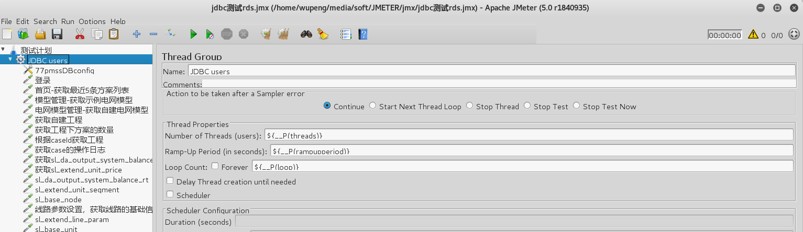
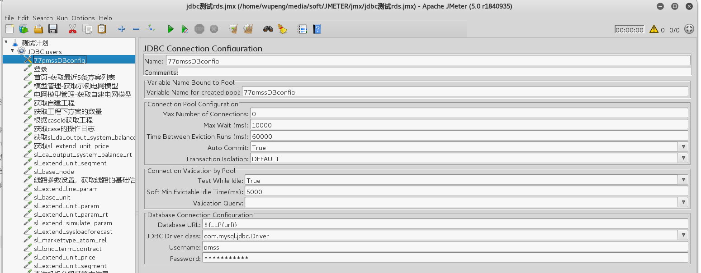
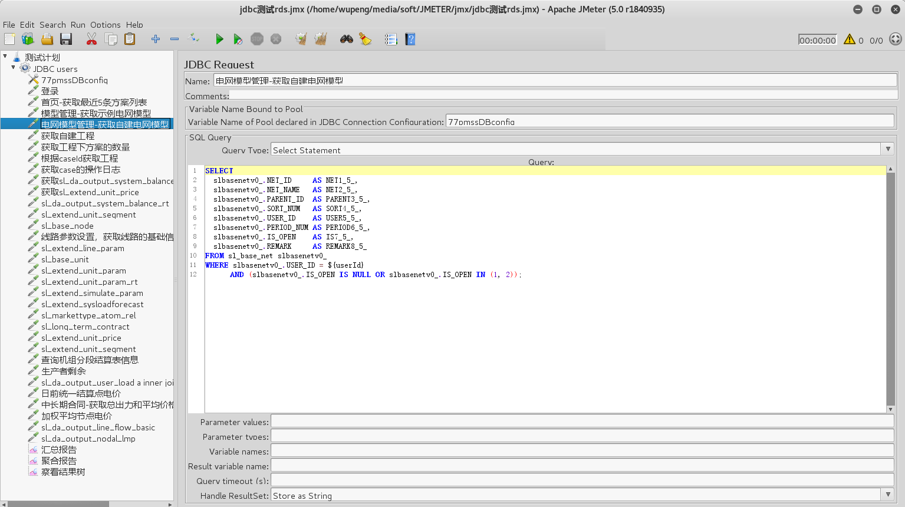

# 使用Jmeter对mysql进行压力测试

jmeter去apache的官网下载最新版本。

jdk建议安装1.8

## 添加mysql的驱动包

将mysql-connector-java-5.X.XX.jar放入jmeter的lib目录下

## 添加线程组

1. 修改测试计划的名称为"测试计划";
2. 添加线程组。右键"测试计划''->add->threads->thread group，在这里修改name,number of threads,ramp-up period,loop count参数

   

## 添加数据库配置

右键线程组，add->config element->jdbc connection configration,修改下列参数：

- variable name for created pool:制定后面每个jdbc请求所引用的jdbc名称.

- database url,
- jdbc driver class 
- username
- password




## 添加jdbc request请求

右键线程组，add->sample->jdbc request



- variable name of pool declared jdbc connection configuration:填写jdbc的引用名
- sql query填写sql语句
- 对于where中的查询变量，可以统一的设置在测试计划的用户自定义变量中。

## 添加监听器

右键线程组，add->listener->view result tree，然后点击开始，调试测试脚本


## 脚本化运行

在GUI模式下运行是很耗费资源，一般在压力测试的时候，都是使用的non-GUI模式下运行。

参考运行脚本如下：

```
../apache-jmeter-5.0/bin/jmeter -n -t ../jmx/jdbc测试rds.jmx -l ../jtl/jdbc测试rds1000.jtl -Jurl=jdbc:mysql://rm-wz94x6564q19ne83y.mysql.rds.aliyuncs.com:3306/tsie_pmss -Jthreads=1000 -Jrampupperiod=3 -Jloop=10 -e -o ../jtl/jdbc-rds1000
```

